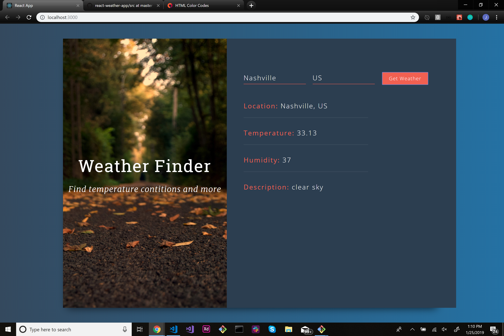

# Built a weather app using React JS, Bootstrap 3, and CSS3.

## With the React Weather App you can 

- Search your home city - or any city for that matter
- The country in which the city is in
- click search
- Voila!
- You will be displayed with an overview of the weather for the current day and time
- The weather is broken down into these categories
> Location
> Temperature
> Humidity
> and a small description of the weather
